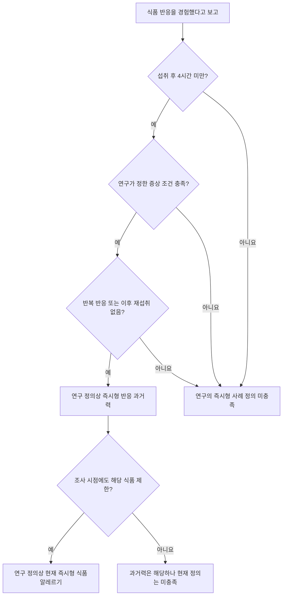
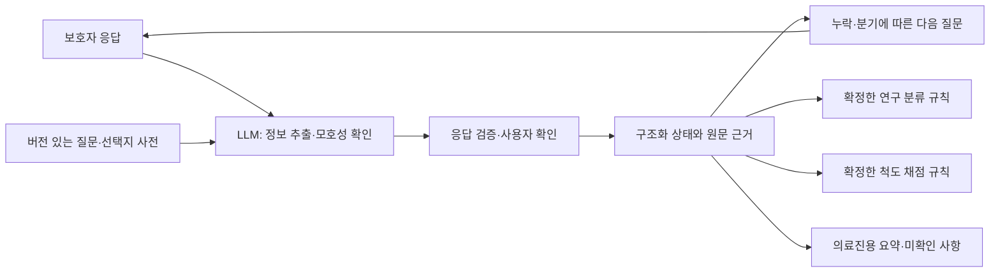

# smart-survey-with-AI-chatbot: 논문·초진 설문지 원문 분석

분석일: 2026-09-15. 제공된 논문 7쪽과 초진 설문지 9쪽 전체 텍스트를 읽고,
설문지 전 페이지 및 논문의 분류도·주요 결과 도표를 페이지 이미지와 대조했다.
페이지 번호는 PDF 기준이며 논문의 인쇄 페이지는 별도로 표시했다.

후속 연구의 첫 구현 범위는 사용자가 지정한 **A–D 프로필 설정 + E의 7개 유형을 선택하는 RL·LLM 문진**이다.
아래 원문 분석은 PSEN-FA까지 포함하되, 첫 action space는 E에 한정한다.
구체적인 코드·웹 구성은 [연구 아키텍처 검토](research_architecture.md)를 참고한다.
재질문, 선택지형·개방형 비교, LLM 정책·공유 생성·내부 판정·보상 논의는 [연구 내용](research_content.md)에 정리한다.

## 1. 핵심 결론

이 프로젝트는 **식품별 반응 병력을 정확하게 수집하고, 보호자의 영양관리 자기효능감 응답을 보존하는 적응형 설문**으로 설계할 수 있다.

| 자료 | 제공하는 근거 | 이 자료만으로 확정할 수 없는 것 |
|---|---|---|
| 2015년 전국 조사 논문, 2017년 발표 | 표본설계, 설문 기반 사례 정의, 식품·연령별 유병률 | 개인의 확진, 챗봇의 진단 성능, 현재 전국 유병률 |
| 외래 초진 설문지 v4 + PSEN-FA | 배경정보, 의심 식품별 병력, 보호자 자기효능감의 질문·선택지 | 논문 조사표와의 완전한 동일성, 공식 채점키·절단점, 챗봇 변형판의 타당도 |

기존 분석에서 바로잡아야 하는 내용:

1. **원본 E·F·G는 각각 다른 식품에 반복하는 같은 7개 문항이다.** 영양관리 설문은 뒤에 별도로 붙은 PSEN-FA다.
2. **PSEN-FA는 27문항이다.** “8–9쪽 문구가 잘려 일부만 판독 가능”이라는 기존 설명은 잘못됐다. 페이지를 이어 읽으면 모두 확인된다.
3. 논문 Fig. 1의 시간 기준은 **섭취 후 4시간 미만**이다. 설문지는 `<30분`, `30분–2시간 미만`, `2–4시간 미만`, `4시간 이상`을 구분한다.
4. PSEN-FA **21번과 23번은 동일 문장**이다. 22·24·25·26·27번은 문장상 부정 방향이다. 중복의 의도와 공식 역채점 규칙은 확인이 필요하다.
5. 현재 연구 코드는 E의 7개 유형을 중심으로 구현했다. A–C 입력은 일부 축약되어 있고 PSEN-FA는 실행 흐름에 포함하지 않는다. 원문 전체 재현이나 검증된 단축 척도로 볼 수 없다.

## 2. 자료와 근거의 범위

- **[논문 PDF](<Prevalence of Immediate-Type Food Allergy in Korean Schoolchildren in 2015- A Nationwide, Population-based Study.pdf>)**: Kim et al., *Allergy Asthma Immunol Res.* 2017;9(5):410–416. [학술지 원문](https://e-aair.org/DOIx.php?id=10.4168%2Faair.2017.9.5.410).
- **[초진 설문지 PDF](<식품알레르기 외래 초진 설문지v4_PSEN.pdf>)**: 1–5쪽 초진 문진, 6–9쪽 PSEN-FA. 제공본에는 일부 식품·섭취형태 등이 이미 기입되어 있다. 이를 신규 응답자의 기본값으로 사용해서는 안 된다.
- **외부 보충 확인**: 2023년 EAACI 진단 가이드라인 및 2025년 PSED-FA 개발·검증 논문의 공개 초록. 제공된 설문지의 버전·채점법과 동일하다고 추정하지 않았다.

이 문서에서 원문 사실과 설계 제안은 구분한다. 2015년 조사 논문에 PSEN-FA가 사용됐다는 근거는 제공된 자료에서 확인되지 않는다.

## 3. 전국 유병률 논문 상세 분석

### 3.1 연구 질문과 표본설계

연구 질문은 “2015년 한국 학령기 아동·청소년의 즉시형 식품알레르기 유병률과 주요 원인 식품은 무엇인가?”다. 보호자가 상세 병력을 응답한 전국 단면조사다. [논문 PDF 1–3쪽, 인쇄 410–412쪽]

| 항목 | 원문 내용 |
|---|---|
| 조사 시기 | 2015년 9월 |
| 연령군 | 6–7세, 9–10세, 12–13세, 15–16세 |
| 추출 규모 | 50,000명: 앞의 두 연령군 각 17,500명, 뒤의 두 군 각 7,500명 |
| 표본설계 | 17개 시·도와 학교급으로 층화한 2단계 확률표집 |
| 학교 추출 | 규모비례확률(PPS) 계통추출; 초등학교 500개, 중·고등학교 각 250개 |
| 학생 추출 | 표본 학교에서 학급을 무작위 추출하는 방식으로 기술 |
| 설문 응답 | 32,001명, 추출 대상의 64.0% |
| 최종 분석 | 결측 처리 후 29,842명, 추출 대상의 59.7% |
| 분석 연령군별 수 | 9,671 / 9,756 / 5,169 / 5,246명 |
| 가중치 | 선택확률 차이, 무응답, 사후층화 보정 반영 |

응답자와 분석자 수의 차이는 2,159명이다. 본문에 결측 처리의 세부 변수·대체법이 충분히 제시되어 있지 않아 특정 결측 대체 알고리즘으로 단정할 수 없다.

**프로젝트에 주는 의미:** 좋은 질문과 많은 응답만으로 전국 대표성이 생기지 않는다. 외래 이용자나 자발적 챗봇 이용자 자료로 전국 유병률을 보고하려면 별도의 표본설계와 분석 계획이 필요하다.

### 3.2 사례 정의와 필요한 질문

논문은 세 가지 상태를 구분한다. [PDF 2쪽 Fig. 1, 3쪽 정의 문단]

| 상태 | 정의 |
|---|---|
| 평생 인지된 식품알레르기, perceived FA ever | 보호자가 식품에 대한 알레르기 반응을 경험했다고 보고 |
| 즉시형 식품알레르기 과거력, immediate-type FA ever | 인지된 반응 + 시간·증상 조건 + 반복 반응 또는 이후 재섭취하지 않음 |
| 현재 즉시형 식품알레르기, immediate-type FA current | 위 과거력 조건을 충족하고 조사 시점에도 의심 식품을 제한 |

다음은 **2015년 연구의 사례 정의**를 설명하는 도식이다.

기계적 구현 전에 보존해야 할 세부 사항:

- Fig. 1은 `<4 hr`와 `≥4 hr`를 명시한다. 본문의 “within 4 hours”보다 도식의 경계가 구체적이며 설문지도 같은 경계를 갖는다. 정확히 4시간인 응답은 마지막 구간이다.
- 증상은 피부·점막, 호흡기, 위장관, 심혈관계로 나눈다. 가려움, 습진 악화, 부종, 기침, 구토, 혈압저하, 의식 변화 등이 포함된다.
- **구토·설사·가려움 등 모호한 증상 하나만 있는 경우는 제외**했다고 기술한다. 원문의 `such as`는 예시이므로 세 항목만으로 완결된 제외 목록이라고 단정하지 않는다. “어떤 증상이든 하나면 제외”라는 뜻도 아니다.
- 반응 후 **다시 먹지 않은 사람도 연구 분류에 포함**된다. 재현성이 확인됐다는 의미로 저장해서는 안 된다.
- 논문은 반복 여부를 Yes/No로 요약하지만 초진 설문지는 “가끔”을 별도 제공한다. 이를 자동으로 No 또는 Yes로 환산하는 정확한 코드북은 확인되지 않았다.
- “현재”는 최근 1년 등의 고정 기간이 아니라 **조사 당시 계속 제한하는 상태**로 정의된다.
- 원문 도식은 모름·불확실을 별도로 설명하지 않는다. 챗봇에서는 이를 음성으로 변환하지 않고 `판정 보류`와 미확인 이유를 보관하는 설계를 제안한다.

조건 미충족이 모든 형태의 식품알레르기 배제를 뜻하지 않는다. 이 연구는 설문으로 즉시형 사례를 구분했으며 참가자 전체를 임상 검사로 확진한 연구가 아니다. EAACI 가이드라인도 병력과 감작 검사를 함께 평가하고 경구유발검사를 진단의 기준 검사로 설명한다. [EAACI 2023](https://pubmed.ncbi.nlm.nih.gov/37815205/)

### 3.3 주요 결과

아래 수치는 제공 논문의 Fig. 2–4와 Table 2에서 확인했다. 현재 시점의 유병률로 해석하지 않는다.

| 연령 | 평생 인지된 식품알레르기 | 현재 즉시형 식품알레르기 |
|---|---:|---:|
| 6–7세 | 17.12% | 3.15% |
| 9–10세 | 17.35% | 4.51% |
| 12–13세 | 14.70% | 4.01% |
| 15–16세 | 14.61% | 4.49% |
| 전체 | 15.82% | 4.06% |

단순한 식품알레르기 인지와 구체적 병력 조건 충족 사이에는 큰 차이가 있다. 다만 측정 기간과 정의가 다르므로 이 차이를 보호자의 오진율이나 설문 분류기의 정확도로 계산해서는 안 된다. [PDF 3쪽 Fig. 2]

**식품별 현재 즉시형 식품알레르기 유병률** [PDF 4쪽 Fig. 3]:

| 개별 식품 | 유병률 | 식품군 등 | 유병률 |
|---|---:|---|---:|
| 땅콩 | 0.22% | 과일류 | 1.41% |
| 계란 | 0.21% | 갑각류 | 0.84% |
| 우유 | 0.18% | 견과류 | 0.32% |
| 메밀 | 0.13% | 생선류 | 0.32% |
| 돼지고기 | 0.10% | 채소류 | 0.27% |
| 닭고기 | 0.06% | 기타 | 1.13% |
| 콩 | 0.06% | | |
| 깨 | 0.05% | | |
| 소고기 | 0.04% | | |
| 밀 | 0.04% | | |

개별 식품 중 연령군별 최다는 계란 → 땅콩 → 우유 → 메밀 순이다. 과일류는 모든 연령군에서 식품군 중 가장 높다. 서로 다른 연령군을 같은 사람의 성장 과정으로 해석할 수는 없다. [PDF 4쪽 Table 2]

식품군은 여러 식품을 묶으므로 땅콩 한 종류와 과일 전체를 같은 단위처럼 비교하지 않는다. 다중 식품 반응도 가능하므로 식품별 비율의 합을 전체 유병률로 사용할 수 없다. “기타”도 1.13%여서 입력 사전을 대표 식품 몇 가지로 닫아서는 안 된다.

**증상·아나필락시스** [PDF 4–5쪽]:

- 현재 즉시형 사례에서 피부·점막 증상 94.3%, 호흡기 16.3%, 위장관 13.3%를 보고한다. 증상군은 중복될 수 있다.
- 전체 학생의 식품 유발 아나필락시스 유병률은 **0.97%**다. 별도로 현재 즉시형 사례 중 **22.5%**에서 아나필락시스를 보고한다.
- 개별 원인 식품은 땅콩 0.08%, 우유 0.07%, 메밀·계란 각 0.06%; 식품군은 과일 0.28%, 갑각류 0.18%, 견과류 0.12%, 생선 0.09%다. 전체 학생을 분모로 한 유병률이며 해당 식품 알레르기 환자의 미래 발생 위험이 아니다.
- 0.97/4.06으로 계산한 비율은 22.5%와 일치하지 않는다. 제시된 요약 수치만으로 분모·가중치 차이를 재구성할 수 없으므로 수치를 임의 수정하거나 환자 수를 역산하지 않는다.
- 아나필락시스는 2006년 합의 기준을 인용하지만 응답을 매핑한 전체 코드북은 본문에 없다. 여러 증상이 **같은 반응 사건에서** 나타났는지 확인할 자료가 필요하다.

### 3.4 강점과 한계

**강점:** 큰 전국 확률표본, 층화·가중치, 상세 병력 기반 분류, 한국의 식품·연령 분포를 제시한다.

**저자들이 논의한 한계:** 폭넓은 아나필락시스 정의, 재섭취하지 않아 자연 소실을 확인할 수 없는 사례의 과대평가, 과일 반응에서 경미한 주관적 증상까지 포함될 가능성. 국가 간 비교도 연구 방법 차이 때문에 제한된다. [PDF 4–6쪽 Discussion]

**방법론에서 도출한 추가 해석:** 알고리즘을 적용해도 보호자 회상·보고 오류는 남는다. 무응답 보정이 모든 편향을 없애지는 않는다. 주요 결과의 신뢰구간, 확진 대비 민감도·특이도, 외부 검증 결과는 제시되지 않았다. 출생·수유·환경 요인의 인과효과나 AI의 성능을 입증하는 연구도 아니다.

## 4. 외래 초진 설문지 상세 분석

### 4.1 실제 구성

| PDF 위치 | 실제 구역 | 내용 |
|---|---|---|
| 1쪽 상단 | 기본정보 | 조사일, 이름 초성, 만 나이, 생년월일, 성별, 키·체중 및 백분위 |
| 1쪽 | A | 과거력·환경요인 12개 번호와 하위 분기 |
| 2쪽 | B | 의사 진단 알레르기 질환 6종의 상태 |
| 2쪽 | C | 어머니·아버지·형제자매의 4종 알레르기 가족력 |
| 2쪽 | D | 의심 식품, 17개 범주 및 구체적 식품명 |
| 3–5쪽 | E·F·G | 식품 1·2·3의 동일한 상세 병력, 각각 1–7번 |
| 6–9쪽 | PSEN-FA | 지난 한 주의 보호자 영양관리 자기효능감, 1–27번 |

F·G 도입부에는 “8번/9번 질문”이라는 오래된 참조가 남아 있다. 4쪽 F의 일부 선택지·라벨은 추출 텍스트에는 있으나 페이지 이미지에서는 보이지 않는다. 동일한 E·G 서식과 대조해 해석했으며, 이 제공본을 정돈된 최종 배포 서식으로 간주하지 않는다.

### 4.2 기본정보·A: 배경 변수

| 항목 | 수집 내용 | 데이터화 주의점 |
|---|---|---|
| 기본정보 | 날짜·연령·성별·신체계측 | 이름은 원문상 초성. 백분위는 임의 계산하지 않음 |
| A1 | 자연분만/제왕절개 | 단일 선택 |
| A2 | 만삭/미숙, 출생체중, 미숙아의 임신 주수 | kg와 주수를 분리 |
| A3 | 자녀를 포함한 형제자매 수 | 1명은 외동 |
| A4 | 모유/분유/혼합, 모유 기간 | 유형과 기간 분리 |
| A5 | 이유식 시작 월령 | 개월 단위 |
| A6–9 | 계란흰자·콩·밀·땅콩/견과류 최초 섭취 월령 | “아직 안 먹음”과 모름 구분; 흰자를 계란 전체로 바꾸지 않음 |
| A10 | 개·고양이 노출 | 각각 현재/과거/가끔/없음과 시기 |
| A11 | 흡연 노출 | 현재/과거/없음, 과거 노출 종료 연령 |
| A12 | 집단생활 시작 연령 | 개월/세 단위를 보존 |

이들은 배경정보로, 2015년 논문의 사례 정의에 모두 필요한 변수는 아니다. “논문 분류 재현”, “초진 기록 완성”, “환경요인 연구”의 목적에 따라 필수 항목을 구분하는 설계를 제안한다.

### 4.3 B·C: 질환력·가족력

- **B:** 천식/세기관지염, 알레르기비염, 알레르기결막염, 만성두드러기, 아토피피부염, 약물알레르기. 각 행은 `있음 / 있었으나 현재 없음 / 없었음 / 모름`이다. 체크박스 목록으로 축약하면 과거력과 불확실성이 사라진다. “천식/세기관지염”처럼 함께 쓰인 원문 항목과 정규화 진단도 구분해야 한다.
- **C:** 어머니·아버지·형제자매 × 아토피피부염·천식·알레르기비염·식품알레르기의 행렬이다. 형제자매를 빠뜨리면 원문 범위가 줄어든다. 종이 빈칸의 의미가 모호하므로 디지털판에서는 없음과 미응답을 명시적으로 구분하는 설계를 제안한다.

### 4.4 D: 식품 목록

17개 범주는 계란, 우유, 콩, 땅콩, 밀, 메밀, 소고기, 닭고기, 돼지고기, 깨, 견과류, 갑각류, 과일류, 채소류, 생선류, 조개류, 기타다. [PDF 2쪽]

설계 제안:

- 사용자 표현과 표준 식품명을 함께 저장한다. “호두”라는 식품과 “견과류”라는 상위군을 구분한다.
- 땅콩/견과류 및 갑각류/조개류를 구분한다. 논문과 초진 설문지의 식품 분류가 완전히 같다고 가정하지 않는다.
- “케이크 먹고 반응”만으로 계란·우유·밀 모두를 원인으로 확정하지 않는다. 혼합 음식과 의심 재료의 불확실성을 보존한다.
- 제공본 D에는 네 식품이 기입됐지만 상세 기입 페이지는 세 장이다. 종이 페이지 수를 식품 수 상한으로 삼지 않고 선택 식품마다 반복 기록을 만든다.
- 의심 식품 없음, 아직 특정하지 못함, 특정 식품을 의심함을 각각 표현한다.

### 4.5 E·F·G: 식품별 반복 병력

| 공통 번호 | 원문 질문 | 응답·연결 |
|---|---|---|
| 1 | 식품명, 섭취형태, 섭취장소 | 세 필드로 저장, 식품과 연결 |
| 2 | 섭취 후 증상 | 18개 선택지, 복수 선택, 기타 서술 |
| 3 | 발현 시간 | `<30분`, `30분–2시간 미만`, `2–4시간 미만`, `4시간 이상` |
| 4 | 반복성 | 반복 / 가끔 / 다시 먹은 적 없어 모름 |
| 5 | 최초 발생 연령 | 개월 또는 세 |
| 6 | 현재 섭취 | 계속 제한 / 이제 문제없어 섭취 |
| 7 | 시행한 검사 | 없음 / 경구유발 / 혈액 / 피부반응; 결과를 묻지는 않음 |

증상 18종은 **두드러기, 가려움증, 피부발진, 습진, 얼굴·눈·입술 부종, 구토, 설사, 복통, 기침, 콧물, 쌕쌕거림, 호흡곤란, 청색증, 혈압저하, 의식저하, 기타**다. 가려움·피부발진은 두드러기와 독립된 선택지다.

원문이 충분히 구분하지 못하는 상황에 대한 **확장 제안**:

- 식품별로 다른 시기의 반응 사건을 분리한다. 서로 다른 사건의 피부·호흡기 증상을 하나의 동시 반응으로 합치지 않는다.
- 섭취량, 최근 반응일, 일부 조리형태만 섭취하는지, 검사 날짜·결과, 의료진 설명, 당시 치료·응급실 방문 등은 확장 필드다. 원문 문항인 것처럼 표기하지 않는다.
- 검사 “받음”을 “양성”으로 변환하지 않는다. 검사 없음과 다른 검사 종류의 동시 선택은 확인한다.
- “피해서 증상이 없다”를 “문제없이 먹는다”로 기록하지 않는다.
- 원문 선택지에 없는 모름·불확실·응답 거부는 별도 상태로 관리한다.

### 4.6 PSEN-FA 27문항 분석

응답 기간은 **오늘을 포함한 지난 한 주**다. 원본 응답 번호는 `0 매우 그렇다 / 1 그렇다 / 2 보통이다 / 3 그렇지 않다 / 4 매우 그렇지 않다`다. 아래 표는 **의미 요약**으로, 실제 질문의 확정 문구나 공식 하위척도 분류가 아니다. [PDF 6–9쪽]

| 번호 | 내용 요약 | 문장 방향·관련 문항 |
|---:|---|---|
| 1 | 제한 식품 때문에 부족할 수 있는 영양소 지식 | 긍정 |
| 2 | 먹을 수 있는 가공식품 판단 | 긍정; 22번과 대응 |
| 3 | 성장·발달에 필요한 영양소 지식 | 긍정 |
| 4 | 보육·교육기관 식단에서 못 먹는 음식 판별 | 긍정 |
| 5 | 보육·교육기관에 식사 관리 사항 전달 | 긍정 |
| 6 | 자녀에게 식품 제한 주의사항 지도 | 긍정 |
| 7 | 자녀의 외부 식사 통제 가능 | 긍정; 24번과 대응 |
| 8 | 성장·발달에 필요한 식사 계획 | 긍정 |
| 9 | 자녀 식사 준비에 대한 자신감 | 긍정 |
| 10 | 자녀와 다른 가족의 식사 함께 준비 | 어려움 없음 |
| 11 | 외부 활동용 대체식품·도시락 준비 | 어려움 없음; 25번과 대응 |
| 12 | 대체 간식의 다양성 | 긍정 |
| 13 | 대체 반찬의 다양성 | 긍정 |
| 14 | 준비한 식사의 영양 공급 적절성에 대한 믿음 | 긍정 |
| 15 | 비알레르기 또래와 비교한 영양 섭취 적절성 | 긍정; 26번과 대응 |
| 16 | 준비한 식사에 대한 자녀의 만족 인식 | 긍정 |
| 17 | 대체식사 준비에서 느끼는 보람 | 긍정 |
| 18 | 자녀 영양관리에 남들보다 노력함 | 긍정 서술; 단순 능력 문항과 의미가 다름 |
| 19 | 전문가 도움을 얻는 경로를 앎 | 긍정; 27번과 대응 |
| 20 | 오프라인 정보 경로를 앎 | 긍정 |
| 21 | 신뢰할 수 있는 온라인 정보 경로를 앎 | 긍정; 23번과 동일 |
| 22 | 먹을 수 있는 가공식품을 판단할 수 없음 | 부정 |
| 23 | 신뢰할 수 있는 온라인 정보 경로를 앎 | 긍정; 21번과 동일 |
| 24 | 자녀의 외부 식사를 통제할 수 없음 | 부정 |
| 25 | 외부 활동용 대체식품·도시락 준비가 어려움 | 부정 |
| 26 | 비알레르기 또래보다 영양소 섭취가 부족하다는 인식 | 부정 |
| 27 | 전문가 도움을 받을 경로가 없음 | 부정 |

**측정·채점에 대한 해석:**

1. 지식·능력·만족·노력에 대한 보호자의 인식이다. 실제 영양소 섭취량이나 영양결핍 진단을 측정한 값이 아니다.
2. 부정 문항은 동의의 의미가 반대이므로 응답 번호를 단순 합산할 수 없다.
3. 문장 방향상 역채점 후보는 식별되지만 제공 PDF에는 공식 채점키·하위척도·결측 처리·절단점이 없다. 응답 번호·버전을 보존하고 총점 계산은 확정 규칙과 분리한다.
4. 21·23번을 중복이라고 삭제하거나 23번을 부정문으로 고치면 원문이 바뀐다. 의도 또는 편집 오류 확인 전에는 각 번호와 확인 필요 표시를 보존한다.
5. 긍정·부정 대응 문항의 불일치는 검토 단서일 수 있으나 불성실 응답·거짓말을 단정할 근거가 되지 않는다.
6. 척도 점수 비교가 목적이면 질문 문구·기간·선택지를 고정한다. 일부 응답만 받은 뒤 LLM으로 나머지 응답을 채워 넣지 않는다.

**관련 검증 논문:** Lee et al. (2025)은 **PSED-FA**라는 명칭으로 보호자 114명의 검증 자료, 세 요인(알레르겐 제한 식사 준비, 영양관리 지식, 식품 제한 관리), 전체 Cronbach α=0.902를 보고한다. 제공본 **PSEN-FA**와 명칭이 다르다. 이번에는 공개 초록을 확인했으며 최종 문항표·채점키와 제공본의 일치 여부는 확인하지 못했다. 따라서 그 신뢰도를 현재 27문항 제공본이나 22문항 코드에 전용할 수 없다. [PSED-FA 개발·검증 논문](https://onlinelibrary.wiley.com/doi/10.1111/pai.70031)

## 5. 두 자료를 연결하는 챗봇 설계

### 5.1 목표에 따라 완료 조건을 구분한다

| 목표 | 필요한 정보 | 완료의 의미 |
|---|---|---|
| 논문 사례 정의 재현 | 경험 유무, 식품별 시간·증상·반복/재섭취·현재 제한 | 확정 코드북으로 분류 가능하거나 불확실 이유가 명시됨 |
| 초진 기록 지원 | 기본·배경 정보, 식품별 상세 병력, 검사력, 미확인 사항 | 의료진이 검토할 기록과 누락 목록이 준비됨 |
| 자기효능감 조사 | 선택한 공식 버전의 문항별 직접 응답 | 해당 버전의 수집·채점 규칙을 충족 |

“핵심 병력이 있다”, “설문을 모두 작성했다”, “척도 총점 산출 가능”은 다른 상태다. 턴 제한 때문에 종료한 경우도 구분해야 한다.

### 5.2 적응형 대화가 유용한 부분

**식품별 병력:** 한 답변에 이미 제공된 정보는 근거와 함께 추출하고 남은 항목·모호한 부분을 묻는다. 같은 식품의 맥락을 유지하며 새 식품으로 넘어갈 때 명시한다.

예: “계란찜을 먹고 20분 뒤 입술이 부었고, 그 뒤로 먹이지 않았어요.”

- 식품·형태: 계란 / 계란찜
- 반응 시간: 20분, 원본 구간 `<30분`
- 증상: 입술 부종
- 재노출: 해당 반응 이후 재섭취 없음

섭취장소·최초 발생 연령은 미확인이다. “그 뒤로”가 현재까지를 뜻하는지도 필요하면 확인한다. 반복성을 확인하려고 다시 먹어보도록 요구할 이유는 없다.

**자기효능감 척도:** 점수 비교가 목적이면 확정 문항을 그대로 제시하고 중립적인 보충 설명을 제공한다. 조사 중 교육·설득이 응답을 바꾸지 않도록 측정과 사후 지원을 구분하는 설계를 제안한다.

### 5.3 모듈 경계 제안

LLM의 언어 이해와 확인 질문, 연구 분류, 척도 계산을 분리하는 안이다. 현재 코드에 모두 구현된 구조는 아니다.

실제 서비스에서는 과거 반응 회상과 **지금 발생하는 급성 증상**을 구분해야 한다. 현재 위험 증상에 대한 설문 중단·안내는 의료진과 정한 별도 경로로 두고 연구용 사례 분류나 정책의 보상값에 맡기지 않는 설계를 제안한다.

### 5.4 저장할 데이터 단위

| 단위 | 권장 정보 |
|---|---|
| 세션 | 조사 목적·날짜, 응답자 관계, 질문지 버전, 진행·종료 상태 |
| 아동 프로필 | 기본정보, 과거력·환경, 질환별 상태, 가족 구성원별 병력 |
| 의심 식품 | 안정적인 food_id, 원래 표현, 표준 식품, 상위군, 불확실성 |
| 반응 사건 | food_id, 섭취형태·장소, 같은 사건의 증상, 발현 시간, 발생 연령 |
| 식품별 현재 상태 | 재노출·반복성, 섭취/회피, 검사력 |
| 척도 응답 | PSEN/PSED 버전, 원본 문항 번호, 선택지 번호, 응답 시점 |
| 추출 근거 | 사용자 원문·턴, PDF 페이지·문항, 확인 여부, 수정 이력 |
| 파생 결과 | 규칙 버전, 충족/미충족/보류와 이유, 점수 산출 가능 여부 |

미응답, 모름, 해당 없음, 응답 거부, 상충된 응답을 구분한다. “보통이다”는 모름의 대체값이 아니다. LLM 추출 확신도, 필수 정보 충족률, 의학적 진단 확률도 서로 다른 값이다.

## 6. 교체 전 프로토타입과 원문의 차이 (분석 당시 기록)

다음 표는 2026-09-15 최초 분석 시점의 이전 프로토타입 기록이다. 이후 PyTorch 연구 코드로 교체했으므로 현재 구현의 결함 목록으로 읽지 않는다. 현재 구조·검증 상태는 [research_architecture.md](research_architecture.md)를 따른다.

| 확인 사항 | 현재 구현 | 영향·다음 수정 방향 |
|---|---|---|
| 구역 명칭 | 내부 E는 식품별 문진, F/G는 척도 18+4문항 | PDF E/F/G와 다름. 의미 기반 모듈명과 원본 문항 ID로 구분 |
| 발현 시간 | 30분 미만 / 30분–1시간 / 1–2시간 / 2시간 이상 / 기억나지 않음 | 2–4시간과 4시간 이상이 구분되지 않아 논문 분류 재현 불가 |
| 증상 | 16개; 가려움 누락, 피부발진은 두드러기와 합침 | 독립된 18개 응답 복원 필요 |
| 척도 범위 | F 18개 + G 4개 = 22개 축약 문항 | 원본 19·20·21·23·27번 누락. G는 원본 22·24·25·26번에 대응 |
| 척도 문구 | 5번의 기관을 “다른 사람”, 18번의 “남들보다”를 “적극적으로” 등으로 바꿈 | 측정 대상·비교 기준 변화; 변형 버전 명시 필요 |
| 배경정보 | 신체계측·출생체중·형제자매 수 등 누락, 여러 항목을 자유서술로 묶음 | 원본 필드 대응 불완전 |
| 질환·가족력 | B는 상태 구분 없는 선택, C는 부모만 | 과거/모름 및 형제자매 정보 손실 |
| 식별정보 | 자녀 이름 필수 | 원문은 이름 초성; 목적에 맞게 정리 필요 |
| 의심 식품 없음 | 브라우저 D 입력 필수 | “없음”을 식품 문자열로 받지 않도록 명시적 상태 필요 |
| 다음 질문 | 기본값은 전체 미응답 후보 중 무작위 선택 | 학습된 RL 정책이 아니며 문맥에 따른 확인 질문 생성 미구현 |
| 식품 맥락 | 시간·최초 연령 질문에 식품명 없이 식품 간 이동 가능 | 화면에 대상 식품을 명시해야 함 |
| 답변 처리 | 선택/서술 응답을 선택 문항 하나에 저장 | 자연어에서 여러 사실을 추출·확인하는 기능 미구현 |
| 충분성 | 식품마다 핵심 4필드 + F 2개 + G 1개 | 원척도 완료나 검증된 임상 충분성 기준이 아님 |
| 확신도·보상 | 전체 응답 수/필요 수를 confidence로 사용, 증가분을 보상 | 필수 병력이 빠져도 1.0 가능; 임상 확신도·검증된 정보이득이 아님 |
| 종료 | 충분성, 기본 20턴, 후보 소진 | 턴 제한에도 “충분히 수집” 메시지 반환; 사유·누락 표시 필요 |
| 검사 검증 | 지원되는 선택지만 확인 | “검사 없음 + 혈액검사” 같은 충돌 확인 필요 |

현재 대응 구현: [질문 사전](../code/src/questionnaire.py), [프로필 화면](../deploy_test/static/app.js), [정책](../code/src/model.py), [근거 판정](../code/src/assessment.py), [문진 환경](../code/src/environment.py), [보상](../code/src/reward.py). 시간 경계와 18종 증상을 복원했고, E의 재질문과 공개 근거 판정·비공개 보상을 분리했다. 이전 F/G 축약 척도는 제거했다.

## 7. 검증 상태와 다음 단계

### 최초 원문 분석에서 확인한 것

- 논문 7쪽·설문지 9쪽 전체 텍스트, 설문지 전 페이지 이미지 확인.
- 논문 Fig. 1 경계값 및 Fig. 3–4·Table 2 수치를 이미지와 대조.
- 실행으로 현재 후보 수 확인: 식품별 7개, F 18개, G 4개, 증상 16개.
- 우유 병력 없이 F 7개만 응답한 상태에서 rule judge가 `sufficient=False`, `confidence=1.0`을 반환하는 것을 재현.
- `max_turns=1`로 종료시켜 충분성 False인데도 “충분히 수집” 문구를 반환하는 것을 재현. 기본 20턴에도 같은 후처리가 적용된다.
- 문법, 문서 내부의 로컬 파일 링크, PSEN-FA 표의 1–27번 연속성을 확인했다. `PYTHONDONTWRITEBYTECODE=1 python -m unittest discover -s tests -v`로 기존 테스트 6개가 통과했다. 이는 코드 경로 확인이며 원문 충실도나 임상 타당도 검증을 뜻하지 않는다.

### 아직 확정하지 못한 것

- PSEN-FA 제공본과 2025년 PSED-FA 최종판의 관계, 공식 문항·채점키, 21/23번 중복 의도.
- 2015년 연구의 완전한 코드북, “가끔”과 모호한 단일 증상의 매핑, 원자료·가중치.
- 챗봇과 종이 설문의 측정 동등성, 의료진 판독과의 일치도, 실제 보호자의 부담·완료 시간.
- 브라우저 사용성 및 외부 LLM 응답 품질은 이번 원문 분석에서 검증하지 않았다.

### 권장 진행 순서

1. **문항 사전 확정:** 페이지·원문 번호·질문·선택지·단위·반복 구조를 연결한다. 시간 구간, 증상 18종, 척도 27문항의 출처 대응을 우선 정리한다.
2. **목표별 완료 조건:** 논문 분류, 초진 기록, 척도 측정을 각각 정의한다. 척도 버전 확정 전에는 응답 보존과 채점을 분리한다.
3. **원문 수집 기준 시스템:** 식품별 반복, 분기, 모름·미응답, 종료 이유를 구현한다.
4. **적응형 챗봇:** 여러 사실 추출, 사용자 확인, 누락·상충 질문을 추가한다. 척도의 표현 변경·문항 생략은 별도 검증한다.
5. **같은 정보 목표로 비교:** 순차·적응형 설문을 문항 충족도, 추출 정확도, 식품/사건 연결 오류, 완료 시간, 이탈률로 비교한다. 질문을 덜 했다는 이유만으로 성능 향상을 주장하지 않는다.
6. **정책 학습 검토:** 정보 품질을 유지하면서 부담을 줄일 수 있는지 확인한다. LLM judge의 confidence 증가만을 성능 목표로 삼지 않는다.

원문 분석을 바탕으로 E 문항 사전과 PyTorch 연구 경로를 구현했다. 다음 검증은 실제 모델의 근거 추출 품질과 전문가 기준이며, 대화형 입력의 이점은 별도 실험으로 확인해야 한다.
