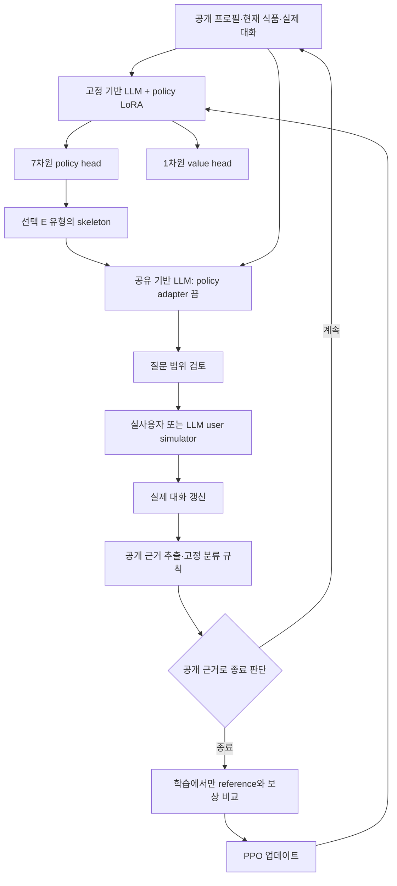

# A–D 프로필 + E 문진: 현재 구현 구조

최종 갱신: 2026-09-15. 상태: **PyTorch 연구 코드 구현, CPU 및 작은 PEFT 모델 검증 완료.**
실제 사전학습 LLM의 CUDA 4-bit 학습과 의료적 타당성은 아직 검증하지 않았다.
실행 방법은 [code/README.md](../code/README.md), 연구 가설은 [research_content.md](research_content.md),
문항 출처는 [questionnaire_analysis.md](questionnaire_analysis.md)를 따른다.

## 1. 구현한 결정

| 항목 | 현재 구현 |
|---|---|
| 사용자 흐름 | A → B → C → D → 프로필 확인 → E 식품별 문진 |
| 식품 반복 | D 순서대로 진행; 식품 하나가 학습 episode 하나 |
| Action | E-1…E-7에 대응하는 index 0…6 |
| 재질문 | 7개 action을 계속 유지; 같은 유형 재선택 가능 |
| 정책 입력 | 공개 프로필·현재 식품·실제 해당 식품의 누적 대화·질문 이력·턴 |
| 주 정책 | 고정 LLM + 학습 LoRA + policy/value head |
| 질문 생성 | 같은 기반 LLM과 기존 lm_head; 선택 유형의 skeleton으로 생성 |
| 공유 범위 | 생성·검토·근거 추출 시 policy adapter 비활성화 |
| 내부 판정 | LLM 근거 추출 + 고정된 초기 연구 분류 규칙 |
| 종료 | 공개 근거 기준 충족 또는 최대 턴; 정답은 보지 않음 |
| 보상 | 종료 후 정답·필요 근거 비교, 선택적인 턴 비용 |
| 상태 | environment.py의 작은 세션 dataclass; state.py 없음 |
| 사용자 시뮬레이터 | user_simulator.py의 LLM 경로와 별도 offline test double |
| PSEN-FA | 이번 action 공간과 실행 흐름에 포함하지 않음 |

식품 N개여도 출력 차원은 7이다. 식품마다 턴 수가 달라지며 7N개의 고정 질문으로 진행하지 않는다.
다른 식품의 이전 대화는 해당 식품 episode에 합치지 않는다. 식품 간 이력을 활용하는 정책은 후속 실험이다.

## 2. 데이터 흐름



한 step은 action 선택 한 번, 실제 질문 한 번, 사용자 응답 한 번이다.
내부 생성·검토 호출 횟수와 경과 시간은 사용자 턴 수와 별도로 기록한다.
다른 유형의 사실을 사용자가 자발적으로 말하면 원문 그대로 남겨 판정에 활용한다.

## 3. 파일과 책임

```text
code/
├── train.py
├── evaluate.py
├── configs/{default,smoke}.yaml
├── src/
│   ├── model.py
│   ├── ppo.py
│   ├── questionnaire.py
│   ├── dialogue.py
│   ├── assessment.py
│   ├── user_simulator.py
│   ├── reward.py
│   ├── environment.py
│   ├── llm.py
│   └── experiment.py
├── api/main.py
├── data/demo_scenarios.jsonl
├── tests/
├── requirements.txt
└── README.md
```

- `model.py`: tokenizer/chat template, 마지막 유효 hidden representation, 7/1 head, LoRA, 공유 생성.
- `ppo.py`: 실제 관찰 토큰을 보관하는 Transition, episode rollout, GAE, PPO minibatch update.
- `questionnaire.py`: 원문 E 7종 대응, 18종 증상, 30분·2시간·4시간 경계.
- `dialogue.py`: 개방형 질문 생성, 고정 기반 모델로 질문 범위 검토, 위반 시 skeleton 대체·기록.
- `assessment.py`: 사용자 근거 인용 검증, prediction·미확인·상충·종료 준비 판정.
- `user_simulator.py`: 시나리오 split 검증, 실제 질문에 답하는 LLM simulator.
- `reward.py`: 배포용 종료 경로와 분리된 reference label·근거 비교.
- `environment.py`: 공개 InterviewSession과 학습용 FoodInterviewEnv 조립.
- `llm.py`: 작은 텍스트 생성 인터페이스와 simulator HTTP client.
- `experiment.py`: YAML 읽기, 컴포넌트 구성, seed, checkpoint와 실험 메타데이터.
- `api/main.py`: 동일 InterviewSession을 이용한 FastAPI, 요청 스키마, 식품 진행·메모리 세션 관리.

기존 `code/baseline`, `code/config`, `code/dialogue`, `code/models`는 제거했다.
기존 root 테스트는 새 `code/tests`로 대체했다. 불필요한 호환 모듈을 남기지 않았다.
`deploy_test/app.py`만 새 API로 이어지는 작은 기존 실행 명령 호환 진입점이다.

## 4. LLM과 학습

기존 vocabulary lm_head를 교체하지 않고 두 head를 병렬로 붙였다.
전체 policy forward에 no_grad를 쓰지 않으므로 LoRA에 gradient가 전달된다.
Rollout은 no_grad로 수집하고 PPO는 저장된 **동일한 토큰**으로 다시 forward한다.

Policy dropout은 rollout과 update에서 끈다. eval()과 gradient 비활성화는 별개다.
Padding을 제외한 마지막 유효 위치를 읽는다. 문맥 길이가 한도를 넘으면 조용히 잘라내지 않고 오류로 중단한다.

첫 구현은 action-only PPO다. 생성·검토·근거 추출에 `disable_adapter()`를 사용해
policy 업데이트가 생성 경로의 유효 가중치를 바꾸지 않게 한다. 같은 물리적 기반 모델을 공유한다.
모델 호출과 adapter 전환은 lock으로 직렬화한다. 이전 호출의 KV cache를 재사용하지 않는다.

`default.yaml`은 일반적인 causal LM 로딩 경로의 `Qwen/Qwen2.5-3B-Instruct` 예제다.
최종 모델 선택이 아니며, Gemma 4의 auto class·processor를 지정하는 방법은 README에 있다.
모델별 CUDA QLoRA 지원은 별도 실행 검증이 필요하다.

Checkpoint는 LoRA와 두 head를 명시적으로 저장한다. Optimizer, update, RNG, 설정,
기반 모델 revision, 질문·prompt·target·보상 버전, 코드/데이터 hash와 패키지 버전도 기록한다.
Tiny 경로는 재현에 필요한 고정 무작위 기반 모델까지 저장한다.

## 5. 공개 정보, 비공개 정보, 보상

정책 observation은 다음 allowlist로 구성한다.

```text
public_profile, food_id, messages, asked_actions, turn_count
```

내부 Assessment는 사용자 발화나 관찰 사실로 대화에 추가하지 않는다.
시뮬레이터에는 해당 식품의 보호자가 아는 비공개 이력과 말투·기억 설정만 전달한다.
reference는 simulator에게도 넘기지 않고 환경의 보상 경로에서만 보관한다.

종료 목표는 `study-2015-operational-v1`이다. 2015년 설문 분류의 보수적인 초기 운영 규칙이며
임상 진단이나 미공개 원문 코드북의 완전한 재현은 아니다.

1. 각 응답 후 고정 LLM 경로에서 현재 식품의 근거·상충을 추출한다.
2. 실제 사용자 발화 ID와 연속된 인용 문자열인지 검사한다.
3. 고정 규칙으로 `meets_criteria / not_meets_criteria / undetermined`와 종료 준비를 정한다.
4. 충분하다고 종료한 뒤 reference label과 사전에 지정한 필요 근거를 비교한다.
5. 오답·근거 부족 종료도 episode를 끝내고 실패 보상을 준다.

증상·발현 시간·재섭취·현재 섭취를 초기 분류 근거로 사용한다.
노출 형태·발생 연령·검사 경험은 질문 가능하고 원문 이력에 보존되지만 초기 terminal 판정의 필수 슬롯은 아니다.
이는 7문항 전체 기록 완성과 다른 목표다.

동일 유형을 재선택한 사실 자체에 벌점을 주지 않는다. 기본 비용은 모든 턴에 공통 적용한다.
`turn_cost=0`이면 terminal-only 보상이다. GAE는 실제 종료와 수집 절단을 구분한다.
현재 collector는 식품 episode를 끝까지 수집하며 최대 턴은 미완료 과제 종료다.

## 6. 웹과 현재 범위

FastAPI를 새 연구 엔진에 연결했다. 기존 정적 HTML/JS는 A–D → 프로필 확인 → E 순서로 동작한다.
초성, 계측, B의 4개 상태, 형제자매 가족력, 식품 없음 입력을 지원한다.
다만 A–C 일부는 묶인 자유서술 입력이며 원문 전체 폼을 정밀 재현한 버전은 아니다.

식품명·전체 식품 위치·응답 횟수를 표시하며 고정된 “7문항 중 완료 수”로 진행을 계산하지 않는다.
최대 턴 종료와 충분한 근거에 의한 종료를 구별한다. 내부 진단 가설·PPO value는 사용자 화면에 전달하지 않는다.

- 현재 frontend: 정적 HTML/JavaScript.
- 현재 backend: FastAPI + Pydantic.
- 향후 frontend 후보: Next.js + React + TypeScript + Tailwind/shadcn.
- 저장: 연구 JSONL/checkpoint, 웹 세션은 메모리.

Next.js UI, DB, 로그인, 운영 배포는 이번 구현 범위에 포함되지 않는다.
웹 요청에는 user simulator와 PPO 업데이트가 들어가지 않는다.

## 7. 검증 결과와 남은 연구

### 실행 확인

- CPU smoke 학습·평가·checkpoint·재개.
- 3회 연속 학습과 2회 후 재개의 모델·optimizer tensor 일치; 관련 테스트 22개 통과.
- 작은 Hugging Face 모델 + 실제 PEFT LoRA의 gradient, 고정 기반 가중치 불변성, 두 head 저장·복원.
- 생성에서 adapter 비활성화, 오류 뒤 adapter 복원.
- 재질문, 자발적 복수 정보, 인용 검증, 모름·상충, reference 변경 시 종료 불변성.
- 30분·2시간·4시간 경계, terminal/collection truncation GAE, food 순서·중복 제출 API.
- JavaScript/shell 문법. FastAPI TestClient는 샌드박스 밖에서 로컬 실행했다.

### 아직 검증하지 않은 부분

- 실제 Gemma/Qwen 가중치, CUDA bitsandbytes QLoRA, GPU 메모리와 처리량.
- 실제 LLM simulator와 질문 생성·판정 전체 연결의 품질.
- 인용의 임상적 의미와 사건 연결의 정확성, 전문가 최소 근거 기준.
- Simulator 사실 일탈 자동 검증, 독립 평가 모델, 실제 보호자의 부담·사용성.

### 후속 실험

선택지 유무 × 재질문 허용의 2×2 비교, 완전 adapter 공유, 학습형 종료,
정교한 보상·독립 전문가 평가, 실제 환자 시나리오 확장이 남아 있다.
현재 구현은 개방형·재질문 허용·외부 고정 종료·action-only PPO 조건이다.
